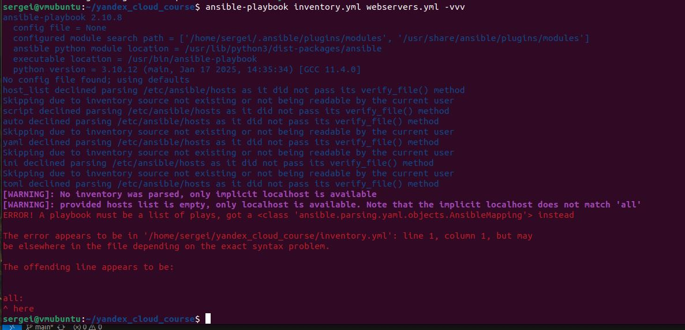

# Курсовая работа на профессии "DevOps-инженер с нуля" - Пронин Сергей Николаевич

- Конфигурация terraform
    - [main](main.tf)  
    - [variables](variables.tf)

- Конфигурация Ansible
     - [inventory.yml](inventory.yml)
     - [webservers.yml](webservers.yml)
     - [zabbix.yml](zabbix.yml)
     - [logging.yml](logging.yml)
     - [filebeat.yml](filebeat.yml)

Зравствуйте!

**Вопрос:**  
У меня получилось создать инфраструктуру через terraform. Но не могу запустить ansible-playbook inventory.yml webservers.yml уже по-разному перепробовал, но не получается. Прошу помочь.

 **Скрин ошибки**  
 