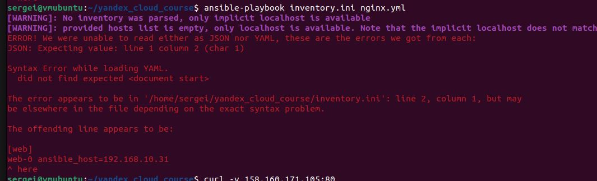
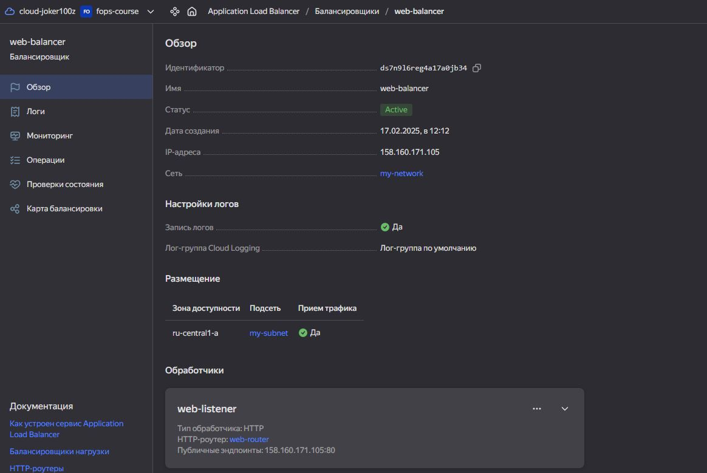
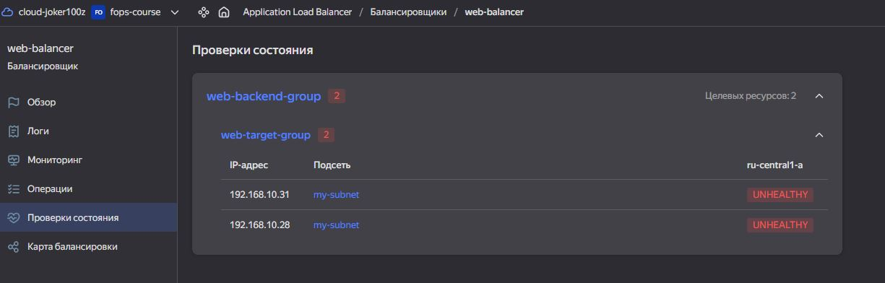

# Курсовая работа на профессии "DevOps-инженер с нуля" - Пронин Сергей Николаевич

- Конфигурация terraform
    - [main](main.tf)  
    - [variables](variables.tf)

- Конфигурация Ansible
     - [inventory.yml](inventory.yml)
     - [webservers.yml](webservers.yml)
     - [zabbix.yml](zabbix.yml)
     - [logging.yml](logging.yml)
     - [filebeat.yml](filebeat.yml)
     - [ginx.yml](nginx.yml)

Зравствуйте!

**Вопрос 1:**  

К сожалению у меня так ине получается запустить:  
```sh
ansible-playbook inventory.ini nginx.yml
```
даже с обновленным inventory.ini

 **Скрин ошибки**  
 

**Вопрос 2:**  
Также обнаружил, что не могу соединиться с ALB
Скрины прилагаю.
Прошу помочь.





