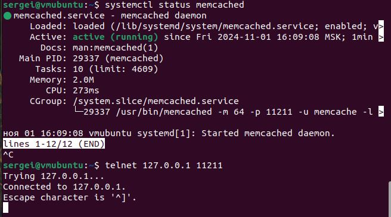

# Домашнее задание к занятию «Кеширование Redis/memcached» - Пронин Сергей Николаевич

---

### Задание 1. Кеширование 

Приведите примеры проблем, которые может решить кеширование.

*Приведите ответ в свободной форме.*

### Решение 1

Проблемы, которые может решить кеширование:

- Снижение времени отклика: Кеширование позволяет быстро извлекать данные из памяти, что значительно уменьшает время ожидания по сравнению с запросами к базе данных или внешним API.

- Сокращение нагрузки на сервер: Часто запрашиваемые данные хранятся в кеше, что снижает количество обращений к серверу и базе данных, уменьшая их загрузку.

- Улучшение производительности: Кеширование повышает общую производительность приложения, особенно при работе с большими объемами данных.

- Экономия трафика: Кешируя данные, можно уменьшить количество сетевых запросов, что полезно для мобильных пользователей или тех, кто ограничен в трафике.

- Увеличение доступности: В случае недоступности баз данных или внутренних сервисов, кешированные данные могут помочь сохранить работоспособность приложения.

- Оптимизация работы с частыми запросами: Кеширование помогает ускорить обработку запросов, которые часто повторяются, такие как статические страницы или результаты поиска. 

- Снижение задержек при пиковых нагрузках: Кеширование может помочь справиться с пиковыми нагрузками, когда большое количество пользователей одновременно запрашивает одни и те же данные.

---

### Задание 2. Memcached

Установите и запустите memcached.

*Приведите скриншот systemctl status memcached, где будет видно, что memcached запущен.*

### Решение 2

---

### Задание 3. Удаление по TTL в Memcached

Запишите в memcached несколько ключей с любыми именами и значениями, для которых выставлен TTL 5. 

*Приведите скриншот, на котором видно, что спустя 5 секунд ключи удалились из базы.*

### Решение 3

---

### Задание 4. Запись данных в Redis

Запишите в Redis несколько ключей с любыми именами и значениями. 

*Через redis-cli достаньте все записанные ключи и значения из базы, приведите скриншот этой операции.*

### Решение 4

