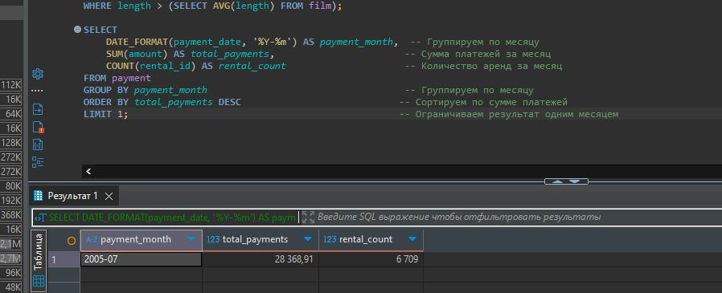

# Домашнее задание к занятию «SQL. Часть 2» - Пронин Сергей Николаевич

### Задание 1

Одним запросом получите информацию о магазине, в котором обслуживается более 300 покупателей, и выведите в результат следующую информацию: 
- фамилия и имя сотрудника из этого магазина;
- город нахождения магазина;
- количество пользователей, закреплённых в этом магазине.

### Решение 1

```sql
SELECT 
    s.last_name AS staff_last_name,  -- Фамилия сотрудника
    s.first_name AS staff_first_name, -- Имя сотрудника
    c.city AS store_city,            -- Город магазина
    COUNT(cu.customer_id) AS customer_count -- Количество покупателей
FROM store st
JOIN staff s ON st.manager_staff_id = s.staff_id  -- Соединяем магазин и сотрудника
JOIN address a ON st.address_id = a.address_id    -- Соединяем магазин и адрес
JOIN city c ON a.city_id = c.city_id              -- Соединяем адрес и город
JOIN customer cu ON st.store_id = cu.store_id     -- Соединяем магазин и покупателей
GROUP BY st.store_id  -- Группируем по магазину
HAVING customer_count > 300;  -- Фильтруем по количеству покупателей
```

### Задание 2

Получите количество фильмов, продолжительность которых больше средней продолжительности всех фильмов.

### Решение 2

```sql
SELECT COUNT(*) AS films_count
FROM film
WHERE length > (SELECT AVG(length) FROM film);
```

### Задание 3

Получите информацию, за какой месяц была получена наибольшая сумма платежей, и добавьте информацию по количеству аренд за этот месяц.

### Решение 3

```sql
SELECT 
    DATE_FORMAT(payment_date, '%Y-%m') AS payment_month,  -- Группируем по месяцу
    SUM(amount) AS total_payments,                       -- Сумма платежей за месяц
    COUNT(rental_id) AS rental_count                     -- Количество аренд за месяц
FROM payment
GROUP BY payment_month                                   -- Группируем по месяцу
ORDER BY total_payments DESC                            -- Сортируем по сумме платежей
LIMIT 1;                                                -- Ограничиваем результат одним месяцем
```
