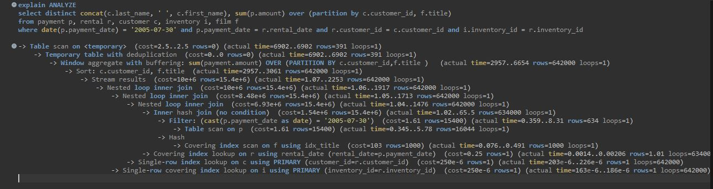
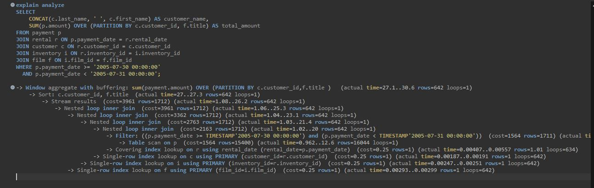

# Домашнее задание к занятию «Индексы» - Пронин Сергей Николаевич

### Задание 1

Напишите запрос к учебной базе данных, который вернёт процентное отношение общего размера всех индексов к общему размеру всех таблиц.

### Решение 1

```sql
SELECT 
    ROUND(SUM(index_length) / SUM(data_length + index_length) * 100, 2) AS index_to_table_ratio_percent
FROM information_schema.TABLES
WHERE table_schema = 'sakila';
```


### Задание 2

Выполните explain analyze следующего запроса:
```sql
select distinct concat(c.last_name, ' ', c.first_name), sum(p.amount) over (partition by c.customer_id, f.title)
from payment p, rental r, customer c, inventory i, film f
where date(p.payment_date) = '2005-07-30' and p.payment_date = r.rental_date and r.customer_id = c.customer_id and i.inventory_id = r.inventory_id
```
- перечислите узкие места;
- оптимизируйте запрос: внесите корректировки по использованию операторов, при необходимости добавьте индексы.

### Решение 2



**Узкие места:**

- Использование DATE(p.payment_date) = '2005-07-30':
    - Функция DATE() применяется к столбцу payment_date, что предотвращает использование индекса по этому столбцу.

- Использование DISTINCT:
    - DISTINCT требует сортировки и удаления дубликатов, что может быть дорогостоящим при большом количестве данных.

- Оконная функция SUM() OVER (PARTITION BY ...):
    - Оконные функции требуют дополнительных вычислений и могут быть медленными, особенно при работе с большими наборами данных.

- Отсутствие явного JOIN:
    - Использование неявного соединения (через WHERE) может затруднить понимание и оптимизацию запроса.

**Оптимизированный запрос**

```sql
SELECT 
    CONCAT(c.last_name, ' ', c.first_name) AS customer_name,
    SUM(p.amount) OVER (PARTITION BY c.customer_id, f.title) AS total_amount
FROM payment p
JOIN rental r ON p.payment_date = r.rental_date
JOIN customer c ON r.customer_id = c.customer_id
JOIN inventory i ON r.inventory_id = i.inventory_id
JOIN film f ON i.film_id = f.film_id
WHERE p.payment_date >= '2005-07-30 00:00:00' 
  AND p.payment_date < '2005-07-31 00:00:00';
```


- Устранены узкие места: использование индексов, замена DATE(), удаление DISTINCT, использование явных JOIN.
- Запрос стал более читаемым и производительным.